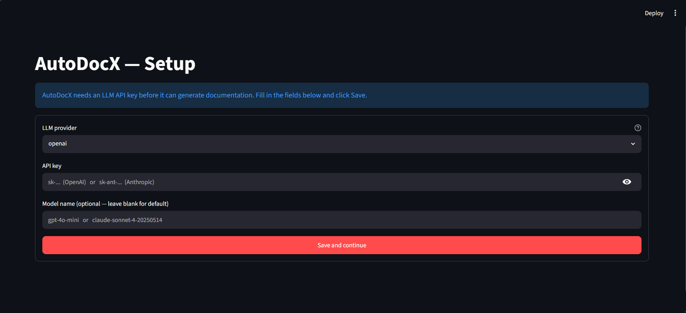
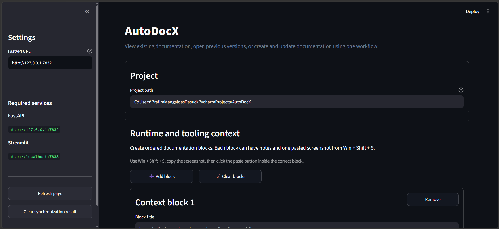
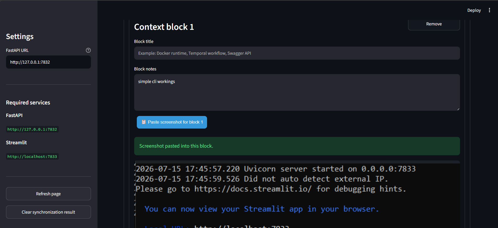
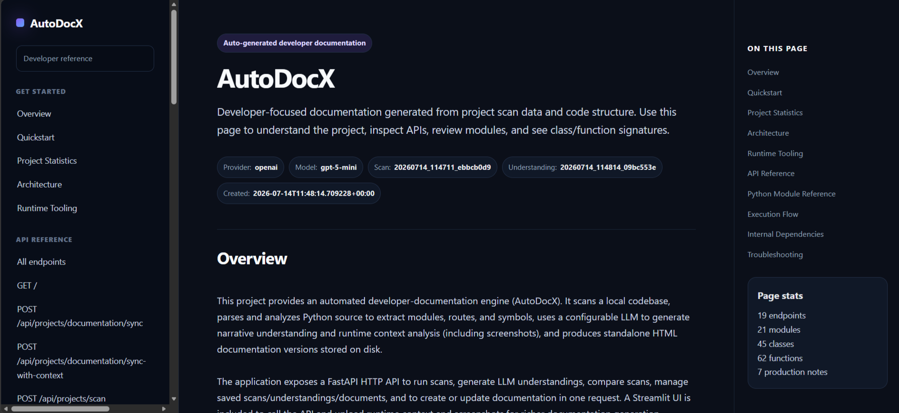

<div align="center">

# AutoDocX 
### *Stop writing documentation. Start shipping code.*

**Scan Code** • **AI Analysis** • **One-Click HTML Docs**

</div>


<div align="center">


</div>

---

## The problem AutoDocX solves

Every developer knows the cycle: code changes fast, documentation doesn't.
Within weeks of a project starting, the docs are wrong. Functions are renamed,
routes are added, architecture shifts  and nobody updates the README.

AutoDocX breaks that cycle by generating documentation directly from the
codebase on every sync. The docs are always a reflection of what the code
actually does, not what someone intended it to do six months ago.

---

## What it does

| Capability | Description |
|---|---|
| Scans your project | Reads every file, extracts structure, calculates change signatures |
| Understands Python code | Parses classes, functions, routes, imports and dependencies via AST |
| Calls an LLM | Generates human-readable summaries, flow explanations and risk notes |
| Detects changes | Compares current state to last documented state using file hashes |
| Generates HTML docs | Produces a self-contained HTML file with navigation, TOC and API reference |
| Keeps version history | Every sync is saved — older versions are never overwritten |
| Accepts screenshots | Paste runtime screenshots directly into context blocks for richer docs |

---

## Installation

> **Requirements:** Windows 10/11 or macOS, internet connection (first run only),
> an OpenAI or Anthropic API key.

### Step 1 — Download the repository

Clone or download this repository as a ZIP and extract it anywhere on your machine.

```
git clone https://github.com/yourname/AutoDocX.git
```

Or click **Code → Download ZIP** on GitHub, then extract.

---

### Step 2 — Run the launcher

**Windows** — double-click `AutoDocX.bat` in the root folder.

**macOS** — open Terminal, navigate to the folder, and run:
```bash
chmod +x AutoDocX_for_mac.sh mac/*.sh   # only needed once after download
bash AutoDocX_for_mac.sh
```

**What happens on first run:**

```
Windows: AutoDocX.bat              macOS: AutoDocX_for_mac.sh
    |                                  |
    +--> Detects no Python runtime     +--> Detects no Python venv
    |                                  |
    +--> Downloads Python 3.11         +--> Finds your system Python 3.10+
    |    embedded (~25 MB)             |    Creates a private venv
    |                                  |
    +--> Installs all packages         +--> Installs all packages
    |    (FastAPI, Streamlit, etc.)    |    (FastAPI, Streamlit, etc.)
    |                                  |
    +--> Creates .env from template    +--> Creates .env from template
    |                                  |
    +--> Starts backend  (port 7832)   +--> Starts backend  (port 7832)
    +--> Starts frontend (port 7833)   +--> Starts frontend (port 7833)
    |                                  |
    +--> Opens browser automatically   +--> Opens browser automatically
```

First-run setup takes about 2 minutes. After that, every launch is instant.

**Nothing is installed on your system.** No global Python, no PATH changes,
no system packages touched. Everything lives inside the AutoDocX folder.

---

### Step 3 — Enter your API key

The browser opens to a setup screen on first launch. Paste your API key and
select your provider (OpenAI or Anthropic). AutoDocX saves it to `.env`
and never asks again.

```
OpenAI   : https://platform.openai.com/api-keys
Anthropic: https://console.anthropic.com/settings/keys
```

---

### Step 4 — Point it at your project

Paste the path to any Python project folder into the input field and click
**Create Documentation**. AutoDocX scans the code, calls the LLM, and
generates a full HTML document.

---

## Using the UI

Once AutoDocX opens in your browser (`http://localhost:7833`), here is what
you will see and what each part does.

---

### Project path input

At the top of the page there is a text input labelled **Project Path**.

Paste the full path to the Python project you want to document.

**Windows example:**
```
C:\Users\YourName\PycharmProjects\MyProject
```

**macOS example:**
```
/Users/YourName/Projects/MyProject
```

**What to paste:** the root folder of your project — the one that contains
your `main.py`, `app/`, or whatever your entry point is. AutoDocX will walk
the entire folder tree from there.

---

### Buttons

| Button | What it does |
|---|---|
| **Create Documentation** | Runs a full scan + LLM analysis + generates a new HTML document. Use this the first time or after major changes. |
| **Sync Documentation** | Re-scans and only regenerates docs for files that changed since the last run. Faster than a full create. |
| **View Latest Document** | Opens the most recently generated HTML file directly in the browser. |

---

### Context blocks (optional — for richer docs)

Below the main buttons you will find the **Runtime Context** section.
This is optional but adds a second layer of detail to your documentation.

You can add one or more context blocks. Each block has:

- **Title** — label for this piece of context (e.g. "Login flow screenshot")
- **Notes** — anything you want the LLM to know about this context
- **Screenshot** — paste a screenshot using `Win + Shift + S` (Windows) or `Cmd + Shift + 4` (macOS), then `Ctrl + V` / `Cmd + V`

AutoDocX sends these to a vision-capable LLM and embeds the descriptions
into the generated HTML alongside the code analysis.

Use **Add Context Block** to add more blocks, and **Remove** to delete one.

---

### Sidebar

The sidebar on the left shows:

- Current backend status (connected / not connected)
- Backend URL (`http://127.0.0.1:7832`)
- Links to the API docs (`/docs`) for direct API access
- Previously generated documents for the current project (click any to open)

---

### Screenshots

**1. API key setup — first launch only**



Enter your OpenAI or Anthropic API key and click **Save API Key**.
AutoDocX writes it to `.env` and loads the main UI immediately.
This screen only appears once — it won't show again on future launches.

---

**2. Main UI — paste your project path here**



Paste the full path to your Python project into the **Project Path** field at
the top. Then use one of the three buttons:

- **Create Documentation** — full scan from scratch, use this the first time
- **Sync Documentation** — only re-processes files that changed, much faster
- **View Latest Document** — opens the most recent generated HTML in your browser

The sidebar on the left shows connection status and links to previous documents.

---

**3. Adding runtime context (optional)**



Scroll down to find the **Runtime Context** section. Click **Add Context Block**
to attach a title, notes, and a screenshot from your running application.
AutoDocX passes these to a vision LLM and adds the descriptions to the generated docs.
Use `Win + Shift + S` to capture, then Click on  `📋 Paste screenshot for block ...` to paste directly into the block.

---

**4. Generated HTML document**



The output opens in your browser as a standalone HTML file — no server needed.
It includes a navigation sidebar, table of contents, module summaries, function
signatures, and a change log showing exactly what was added or modified since
the last sync.

---

## Where your documentation lives

Every document AutoDocX generates is saved as a standalone HTML file:

```
AutoDocX/
  workspace/
    documents/
      YourProjectName/
        abc123de.html          <-- open this in any browser
        def456ab.html          <-- older version, still there
        metadata/
          abc123de.json
```

To view a document: open the HTML file in any browser — no server needed,
no internet connection needed. The file is fully self-contained with
navigation, table of contents, and code references all embedded.

Each sync creates a **new versioned file**. Old versions are never deleted,
so you can compare docs across time just by opening different HTML files.

---

## Architecture

```
+-----------------------------------------------------------------------+
|                            AutoDocX.bat                               |
|                    The only file the user touches                     |
+-----------------------------------+-----------------------------------+
                                    |
                                    | invokes
                                    v
+-----------------------------------------------------------------------+
|                      scripts/run_autodocx.ps1                         |
|                 Lifecycle manager: install, start, stop               |
+------------------+----------------------------------------------------+
                   |
       +-----------+------------+
       |                        |
  first run only            every run
       v                        v
+------+----------+    +--------+-----------------------------------------+
| setup_runtime   |    |                Start both servers                |
| .ps1            |    |                                                  |
|                 |    |   +--------------------+  +------------------+   |
| Downloads       |    |   |   FastAPI Backend  |  |  Streamlit UI    |   |
| Python 3.11     |    |   |   port 7832        |  |  port 7833       |   |
| embedded        |    |   |   /api/projects/.. |  |  browser-based   |   |
|                 |    |   +--------+-----------+  +--------+---------+   |
| Installs all    |    |            |                       |             |
| packages from   |    |            | REST API calls        | user input  |
| requirements    |    +------------+-----------------------+-------------+
| .txt            |                 |
+-----------------+                 v
                     +----------------------------------------------+
                     |         Documentation Pipeline               |
                     |                                              |
                     |  [1] ProjectScanner                          |
                     |      Walk files, SHA-256 hash, metadata      |
                     |             |                                |
                     |             v                                |
                     |  [2] PythonCodeParser                        |
                     |      AST: functions, classes, routes,        |
                     |      imports, decorators, docstrings         |
                     |             |                                |
                     |             v                                |
                     |  [3] ProjectAnalyzer                         |
                     |      Module map, internal dependencies,      |
                     |      FastAPI route discovery                 |
                     |             |                                |
                     |             v                                |
                     |  [4] ScanComparator                          |
                     |      Diff vs previous scan                   |
                     |      |                                       |
                     |      +-- unchanged --> return existing doc   |
                     |      |                                       |
                     |      v  changes found                        |
                     |  [5] LLM Provider  (OpenAI / Anthropic)      |
                     |      Summaries, flow explanations,           |
                     |      risk notes  (narrative only)            |
                     |             |                                |
                     |             v                                |
                     |  [6] DocumentBuilder                         |
                     |      HTML: navigation, TOC, API cards,       |
                     |      function signatures, version links      |
                     |             |                                |
                     |             v                                |
                     |  [7] DocumentStorage                         |
                     |      workspace/documents/ProjectName/        |
                     |      Versioned HTML + metadata JSON          |
                     +----------------------------------------------+
```

---

## How the LLM is used

AutoDocX is designed so the LLM never invents code details.

The **AST parser owns all facts** — function signatures, class names, route
paths, parameter types, return annotations. These are extracted directly from
the Python source and injected into the HTML unchanged.

The **LLM owns the narrative** — plain-English summaries, flow explanations,
architecture descriptions, and risk observations. It is only asked to write
the parts a developer would normally write by hand.

Both layers are merged before the HTML is generated. This means the
documentation is accurate by construction, not by luck.

---

## Runtime context and screenshots

AutoDocX supports an optional layer of runtime documentation alongside the
code analysis. In the Streamlit interface, you can create ordered context
blocks — each with a title, notes, and a pasted screenshot from
Win + Shift + S.

These blocks are sent to a vision-capable LLM which describes what is running,
what tools are in use, and what the screenshots reveal about runtime behaviour.
The result is embedded directly into the generated HTML alongside the
code-level documentation.

---

## Configuration

The `.env` file is created automatically on first run. The setup screen
in the browser guides you through adding your API key. You never need to
touch it manually unless you want to change the provider or model.

```env
LLM_PROVIDER=openai              # openai or anthropic

OPENAI_API_KEY=sk-...
OPENAI_MODEL=gpt-4o-mini         # optional, this is the default

ANTHROPIC_API_KEY=sk-ant-...
ANTHROPIC_MODEL=claude-sonnet-4-20250514
```

---

## REST API

The FastAPI backend runs at `http://127.0.0.1:7832` with interactive
docs at `http://127.0.0.1:7832/docs`.

**Full documentation sync (recommended):**
```
POST /api/projects/documentation/sync
Content-Type: application/json

{ "project_path": "C:\\Users\\Name\\Projects\\MyProject" }
```

**Sync with runtime context and screenshots:**
```
POST /api/projects/documentation/sync-with-context
Content-Type: multipart/form-data

project_path, context_blocks_json, screenshots[]
```

---

## Technology

| Layer | Technology |
|---|---|
| Language | Python 3.11 |
| Backend framework | FastAPI + Uvicorn |
| Browser interface | Streamlit |
| Code analysis | Python AST (zero LLM for facts) |
| LLM providers | OpenAI GPT, Anthropic Claude |
| Runtime | Python 3.11 embedded — no system Python needed |
| Output format | Self-contained versioned HTML |
| Storage | Local JSON + HTML on the file system |
| Windows launcher | Batch + PowerShell (no admin rights required) |
| macOS launcher | Bash shell scripts (no admin rights required) |

---

## Planned features

- Markdown and PDF export
- Git-based change detection
- Multi-project dashboard
- Docker support
- Support for JavaScript and TypeScript projects
- CI/CD integration for automated documentation on push

---

<div align="center">

Built for developers who write code, not documentation.

</div>
